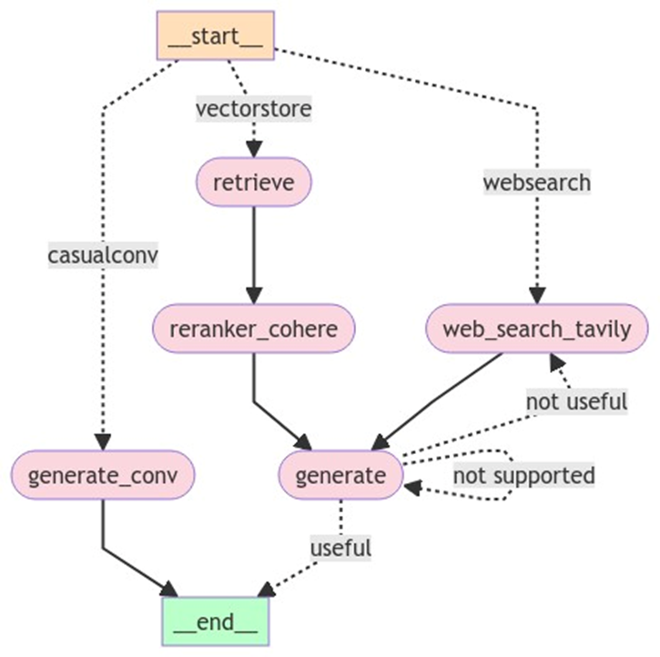

## Query Router | Hallucination Grader | Reranker | Web Search
### Langchain | LangGraph | Claude3.5 | Wevieate | Cohere | Tavily(advanced) | Fastapi | Streamlit

### summary
RAG Framework : Langchain\
Workflow control : LangGraph\
LLM : Claude sonnet 3.5\
text embedding : Openai\
vector DB : Wevieate\
chunk method : RecursiveCharacterTextSplitter\
reranker : Cohere\
web search : Tavily\
Application Interface : Fastapi + Streamlit

